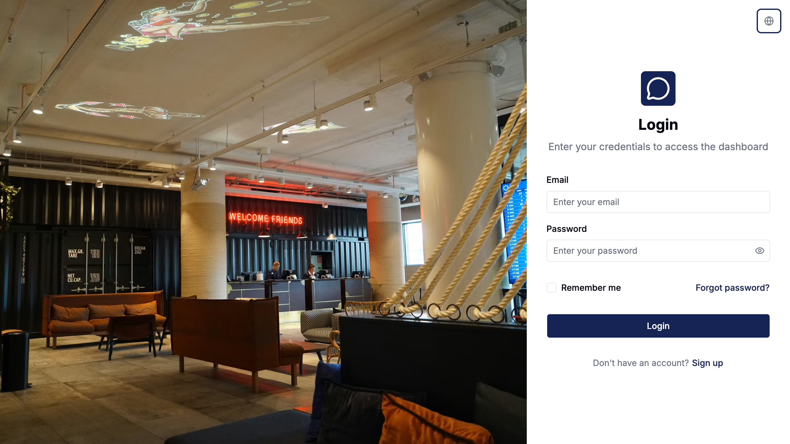
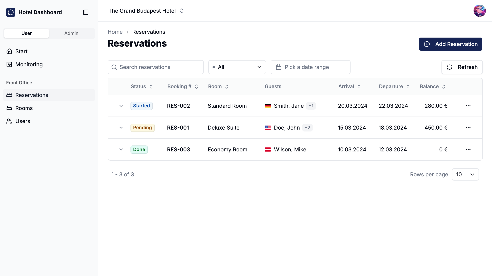

# Hotel Dashboard

A hotel management dashboard with dual-view architecture (User View for front-office operations, Admin View for administrative functions). Built with React 19, TypeScript, and a full-stack Bun + Express backend.

| Login | Reservations |
|:---:|:---:|
|  |  |

[Live Demo](https://backoffice-hotel-dashboard.vercel.app)

## Tech Stack

### Frontend

- **React 19** + TypeScript + Vite
- **TanStack Router** — file-based, type-safe routing
- **TanStack Query** — server state management
- **TanStack Table** — data grids
- **Tailwind CSS 4** + shadcn/ui + Radix UI
- **Lingui** — i18n (English & German)
- **Recharts** — charts and analytics
- **React Hook Form** + Zod — form handling and validation

### Backend

- **Express 5** + TypeScript (runs on Bun)
- **PostgreSQL** on Neon (serverless)
- **Drizzle ORM** — schema, migrations, queries
- **Zod** — runtime validation
- **Jose** — JWT authentication
- **Nodemailer** — transactional emails

### Testing & Quality

- **Vitest** — unit/integration tests (frontend & backend)
- **Playwright** — end-to-end tests
- **Biome** — linting and formatting
- **Husky** + **Commitlint** — conventional commits
- **Semantic Release** — automated versioning and changelogs

## Getting Started

### Prerequisites

- [Bun](https://bun.sh/) (runtime and package manager)
- Node.js >= 22.19.0
- PostgreSQL database (or a [Neon](https://neon.tech/) account)

### Installation

```bash
# Install frontend dependencies
bun install

# Install backend dependencies
cd backend && bun install
```

### Environment Variables

Create `.env` files based on your environment:

**Frontend** (root `.env`):

```bash
VITE_API_BASE_URL=http://localhost:5001/api
```

**Backend** (`backend/.env.development`):

```bash
DATABASE_URL=postgresql://...
CORS_ORIGIN=http://localhost:5173
SMTP_HOST=sandbox.smtp.mailtrap.io
SMTP_PORT=587
SMTP_USER=...
SMTP_PASS=...
SMTP_FROM=noreply@example.com
APP_URL=http://localhost:5173
```

### Running

```bash
# Full-stack development (frontend + backend)
bun run dev

# Frontend only
bun run client

# Backend only (from ./backend)
bun run dev
```

The frontend runs at `http://localhost:5173` and the backend at `http://localhost:5001`.

## Scripts

### Frontend (root)

| Command | Description |
|---|---|
| `bun run dev` | Start full-stack dev (client + backend) |
| `bun run client` | Start frontend only |
| `bun run build` | Production build (includes type-check) |
| `bun run type-check:all` | Check both main and node TS configs |
| `bun run lint` | Biome linter with auto-fix |
| `bun run check` | Biome check with auto-fix (lint + format) |
| `bun run test` | Run unit tests |
| `bun run test:e2e` | Run Playwright E2E tests |
| `bun run lingui:extract` | Extract translatable strings |
| `bun run lingui:compile` | Compile translation catalogs |

### Backend (`./backend`)

| Command | Description |
|---|---|
| `bun run dev` | Start in watch mode |
| `bun run start` | Start in production mode |
| `bun run test` | Run backend tests |
| `bun run db:seed` | Seed database with sample data |
| `bun run db:push` | Push schema changes to database |
| `bun run db:studio` | Open Drizzle Studio GUI |

## Project Structure

```
├── src/
│   ├── routes/
│   │   ├── _auth-layout/         # Auth pages (login, sign-up, etc.)
│   │   └── _dashboard-layout/
│   │       ├── (user-view)/      # Front-office operations
│   │       │   ├── (front-office)/  # Reservations, payments, orders
│   │       │   ├── rooms/        # Room management
│   │       │   ├── products/     # Product catalog
│   │       │   ├── users/        # User management
│   │       │   └── ...           # Analytics, devices, CMS, etc.
│   │       └── admin/            # Admin view (properties, customers)
│   ├── components/ui/            # shadcn/ui components
│   ├── hooks/                    # Shared React hooks
│   ├── lib/                      # Utilities
│   └── locales/                  # i18n message catalogs (en, de)
├── backend/
│   └── src/
│       ├── controllers/          # Route handlers
│       ├── db/                   # Schema, migrations, connection
│       ├── middleware/            # Auth, validation, rate limiting
│       ├── routes/               # Express route definitions
│       └── utils/                # Email, helpers
├── e2e/                          # Playwright test specs
└── shared/                       # Shared types between frontend & backend
```

## Internationalization

The app supports **English** and **German** via [Lingui](https://lingui.dev).

- Use `<Trans>` for JSX text, `t` macro for strings/toasts/validation
- Message catalogs live in `src/locales/{locale}/messages.po`
- Extract with `bun run lingui:extract`, compile with `bun run lingui:compile`
- Language switching is available in the header user menu

## Deployment

- **Frontend** — [Vercel](https://vercel.com) with API rewrites proxying `/api/*` to the backend
- **Backend** — [Fly.io](https://fly.io) (Frankfurt region), configured via `fly.toml`
- **Database** — [Neon](https://neon.tech) serverless PostgreSQL

## Code Quality

- **Biome** handles linting and formatting (replaces ESLint + Prettier)
- **Conventional commits** enforced via Husky + Commitlint
- Always run `bun run type-check:all && bun run check` before committing
